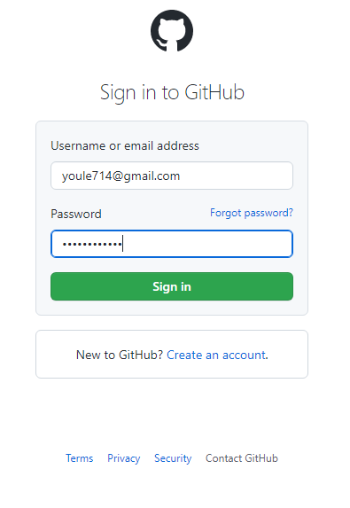
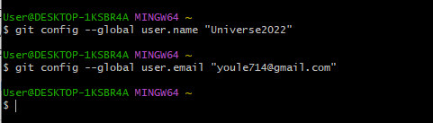
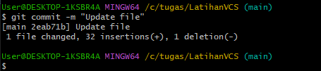

# LatihanVCS
## Langkah - langkah Cara Menggunakan Git
### 1. Login terlebih dahulu di github.com

### 2. Setelah login buat Repository baru pada GitHub

### 3. Buat Nama Repository LatihanVCS setelah ikuti gambar yang dibawah ini

### 4. Login pada git bash menggunakan username dan email untuk menghubungkan ke GitHub

### 5. Masuk ke GitHub dan copy link HTTPS untuk clone

Lakukan git clone https://github.com/MIGHTY-LANTERN/LatihanVCS.git untuk memindahkan file yang ada pada github ke direktori c
untuk mengecek https pada web dengan klik code pada repository

#### 6. Buka Git Bash lalu pindahkan penyimpanan file ke yang diinginkan
#### Setelah itu git clone https://github.com/MIGHTY-LANTERN/LatihanVCS.git

#### 7. Cek direktori pada folder di Laptop

### 8. Buka folder LatihanVCS, buka file README.md, dan edit file README.md 

### 9. Buka Git Bash Tambahkan syntax git add readme.md

### 10. Tambahkan syntax git commit "Update file"

### 11. Tambahkan syntax git push -u origin main
### 12. Cek repository pada akun github

SELESAI.
